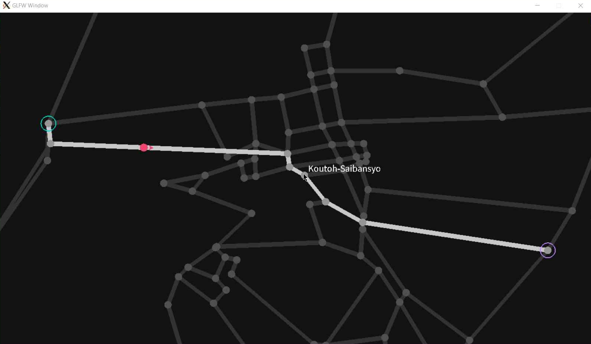

# Simple Car Navigation Program

## Introduction

This project develops a mini version of Google Map, termed as a car navigation program, using GLFW for graphical display.
The program asks the user to choose points of interest (start and destination) via keyboard or mouse.
It employs the Dijkstra algorithm to determine the shortest path from start to the destination, displaying the map, path, and car movement in a GLFW window.

<p align="center">
   <br>
  Screenshot of the program.
</p>

## Key Components

- `main.c`: Contains the main function, including window initialization.
- `algo.c`: Stores algorithms, e.g., Dijkstra, swap, and functions related to array operations.
- `display.c`: Manages display functionalities, such as drawing the map or car, reading mouse positions, and map projection adjustments.

## Dependencies

#### GLFW (Legacy)

To install the legacy version of GLFW, follow these steps:

```bash
git clone git@github.com:glfw/glfw-legacy.git
cd glfw-legacy
make ...
```

#### FreeType2

For FreeType2, install the development libraries (Debian-based):

```bash
sudo apt install libftgl-dev libfreetype6-dev
```


## Usage

To compile and run the project, follow these simple steps:

```bash
make
./bin/run
```

Ensure you have installed the [Dependencies](#dependencies) before attempting to compile and run the project.